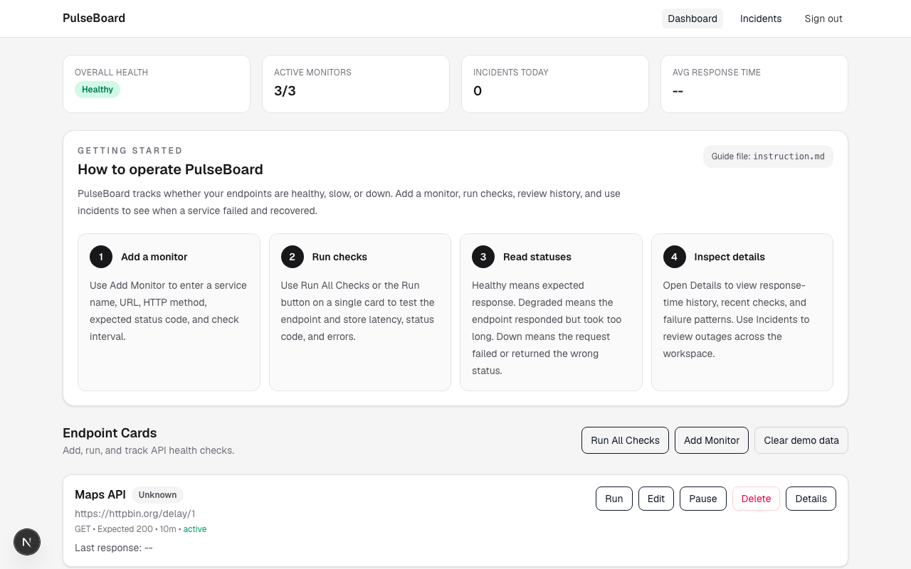
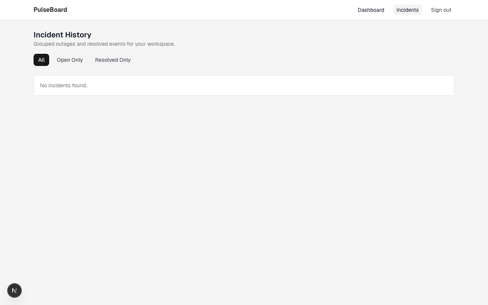

# PulseBoard 🚀

PulseBoard is a lightweight, developer-focused API status and latency monitor. Built as a clean, responsive SaaS-style dashboard, it lets you create monitors, track response times, inspect latency history charts, and review outages—all powered by a free-tier database backend.

It is designed to be run as a **completely free self-hosted dashboard** for developers, or configured as a **commercial SaaS platform** using built-in Stripe subscription billing.

---

## Screenshots

| Dashboard | Incidents History |
|---|---|
|  |  |

---

## Key Features

*   🔒 **Secure Workspace Isolation:** User account creation and authentication powered by Firebase Auth.
*   📊 **Real-Time Monitor Management:** Create, edit, pause, resume, and delete HTTP monitors.
*   🛡️ **Hardened Check Runner:** Immediately retries failing probes up to 3 times (with a 1-second delay) before declaring an endpoint "down" to prevent false alerts.
*   ⏱️ **Isolated Background Scheduler:** Uses Next.js 16's stable `after` API to run checks asynchronously without blocking web requests or causing serverless timeouts.
*   🚨 **Outage & Recovery Alerts:** Dispatches outage alerts and recovery emails automatically via **SMTP** or **Resend API**. Resolves user emails dynamically using Firebase Admin.
*   📂 **Interactive Incidents History:** Tracks outages and recoveries. Includes server-side status filters (**All**, **Open Only**, **Resolved Only**) using fast Next.js query parameter navigation.
*   💳 **Stripe Subscription Integration:** Turn on commercial plan limits (e.g. 3-monitor cap on Free plan, unlimited on Pro) using environment toggles, complete with Stripe Checkout, Stripe Webhook updates, and self-service Customer Portal redirects.

---

## Tech Stack

*   **Framework:** Next.js 16.2 (standalone server output)
*   **Frontend Library:** React 19 + Tailwind CSS
*   **Database & Auth:** Google Cloud Firestore + Firebase Authentication (Node.js Admin SDK)
*   **Mailing:** Nodemailer (SMTP) / Resend REST API
*   **Charts:** Recharts
*   **Validation:** Zod
*   **Billing (Optional):** Stripe Node.js SDK

---

## Local Development (Quick Start)

PulseBoard supports local development using the **Firebase Emulator Suite** so you don't need a live cloud database to write code.

### 1. Install Dependencies
```bash
npm install
```

### 2. Configure Environment variables
Create a `.env.local` file by copying the example:
```bash
cp .env.example .env.local
```

### 3. Start Firebase Emulators
Make sure you have Java installed to run the emulators:
```bash
npm run dev:emulators
```

### 4. Run the Web Application
Open another terminal tab and run:
```bash
npm run dev
```

The application will be live at `http://localhost:3000`. You can log in using any email/password (e.g. `test@example.com` / `password123`) inside the emulator context.

---

## Deployment & Self-Hosting

PulseBoard is packaged to be extremely easy to deploy.

*   **Self-Hosting Guide:** See [SELF_HOSTING.md](./SELF_HOSTING.md) for step-by-step instructions on deploying to **Vercel** or running in a **Docker Container** using `docker-compose.yml`.
*   **Production Hardening details:** See [DEPLOY.md](./DEPLOY.md) to set up production service accounts and secrets.
*   **Running into issues?** See [TROUBLESHOOTING.md](./TROUBLESHOOTING.md) for a full list of known issues and fixes.

---

## Open Core & Billing Gating

PulseBoard uses a toggle-based billing system to support both open-source users and paid setups:

*   **Self-Hosted Mode (Default):** With `NEXT_PUBLIC_BILLING_ENABLED=false`, all limits are removed. You and your users can create unlimited monitors and run checks for free.
*   **SaaS Mode (Hosted Cloud):** Set `NEXT_PUBLIC_BILLING_ENABLED=true` and configure your `STRIPE_SECRET_KEY` and price IDs. This automatically limits Free users to **3 monitors** and requires an upgrade to the Pro plan via Stripe Checkout to unlock unlimited monitors.

---

## Contributing & Development Scripts

*   `npm run dev` — Run development server
*   `npm run dev:emulators` — Run local Firebase Auth & Firestore emulators
*   `npm run lint` — Lint code using ESLint
*   `npm run build` — Compile production Next.js build (using standalone output)
*   `npm run firebase:deploy:rules` — Deploy Firestore indexes & rules to your live project

---

## License

PulseBoard is licensed under the **[Elastic License 2.0 (ELv2)](./LICENSE)**.

### What this means in plain English

| | Allowed |
|---|---|
| ✅ | Use PulseBoard for your own projects |
| ✅ | Self-host it for your team or company |
| ✅ | Read, study, and modify the source code |
| ✅ | Contribute improvements back via Pull Requests |
| ✅ | Fork it for personal or internal use |
| ❌ | Offer it as a **hosted/managed service** to third parties |

The one restriction: you cannot take this code and run your own competing "PulseBoard as a Service." That's how we keep the lights on.

Everything else — self-hosting, contributions, internal use, learning from it — is completely free and welcome.

### Want to contribute?

Read [CONTRIBUTING.md](./CONTRIBUTING.md). We actively welcome bug fixes, features, and improvements. When you contribute, your changes become part of PulseBoard under the same ELv2 license.

### Commercial / OEM licensing

Need to embed PulseBoard in a commercial product, or want to run it as a managed service? Get in touch via [GitHub Discussions](https://github.com/LarryAlexander/Api-Stat-Monitor/discussions) to discuss commercial licensing terms.

