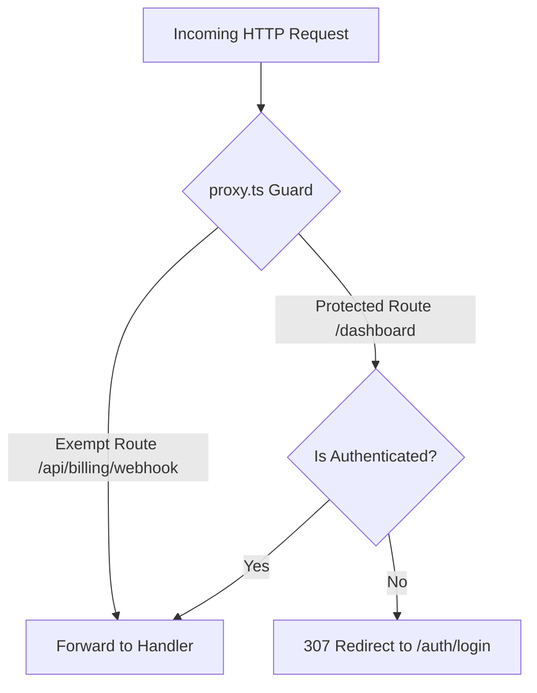

# Architecture & Data Flow

PulseBoard is built using a modern, serverless-friendly architecture designed to scale with minimal operational overhead.

## Technology Stack

- **Framework**: Next.js 16.2 (App Router with `Turbopack`)
- **Styling**: Tailwind CSS v4 (Sleek dark modes, custom HSL color palette)
- **Database & Auth**: Cloud Firestore + Firebase Authentication (Google SSO + Email/Password)
- **Billing**: Stripe (Subscription modeling, checkout sessions, billing portals)
- **E2E Testing**: Playwright (20 automated assertions)
- **Containerization**: Docker (Multi-stage standalone Next.js builder)

---

## Technical Flow Diagrams

### 1. The Check Execution Pipeline (Next.js `after()`)
To prevent HTTP request timeouts and cold starts from terminating check runs prematurely, PulseBoard leverages Next.js 16's native `after()` utility for out-of-band background tasks.

```mermaid
sequenceDiagram
    autonumber
    participant Cron as External Cron / Operator
    participant Route as /api/checks/scheduled
    participant Runner as checkRunner.ts
    participant DB as Cloud Firestore
    participant Alerts as Alerts Dispatcher (SMTP/Resend)

    Cron->>Route: GET (with CRON_SECRET)
    Note over Route: Authenticate Secret
    Route->>Cron: 202 Accepted (Triggers Background after())
    
    rect rgb(20, 20, 20)
        Note over Route: Background thread starts
        Route->>DB: Fetch monitors due for check
        DB-->>Route: Active Monitors
        
        loop For each due Monitor
            Route->>Runner: runCheck(monitor)
            Runner->>Runner: Execute ping & follow up to 5 redirects
            Note over Runner: Handle Immediate Retries (1s) on failure
            Runner-->>Route: Result (status, latency, code)
            Route->>DB: Save Check & Update Monitor status
            
            alt Status Changed (Up <-> Down)
                Route->>Alerts: Dispatch Alert
                Alerts->>Alerts: SMTP -> Resend -> Fallback Log
            end
        end
    end
```

### 2. Authentication and Route Protection (`proxy.ts`)
Next.js 16 utilizes a custom `proxy.ts` export for request-level routing controls.

### 3. Stripe Billing Gating
When billing is enabled (`NEXT_PUBLIC_BILLING_ENABLED=true`), workspace limits are enforced at the Firestore level:
1. Every write operation checks the active subscription state on the workspace.
2. If `subscription_status` is not `active` or `trialing`, the system limits the number of monitors they can create.
3. Stripe webhooks listen for `customer.subscription.updated` events to immediately synchronize subscription statuses to Firestore.
